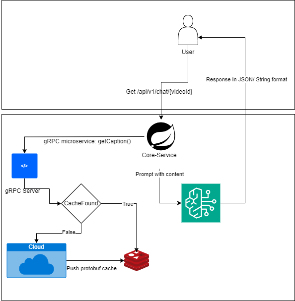

## YoutubeSummary
YoutubeSummary is a Large Language Model(LLM) solution that helps you summarize videos on Youtube.

Although many youtubers generate their own summarization and snippets of the videos, it's not always the case. YoutubeSummary provides **concise summary** of each essential point of the video, and includes the **starting point** from the video so you have the chance to dive deep into the interested content.

Demo record: https://www.youtube.com/watch?v=xhHMegRqRpc

### Tech Stack:
- Spring Boot/ Spring AI
- Large Language Model(Open AI)
- Upstash(Redis)
- gRPC
- Microservice architecture

The Architecture diagram of the application is shown below:

### Contact
Zhengliang Puck Wang - wzlpuck@gmail.com
LinkedIn: [@puck-wang](https://www.linkedin.com/in/puck-wang-2020/)
